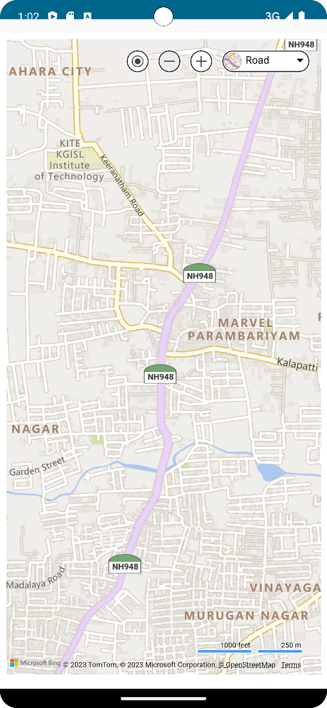

# MapWebView-Android-Jetpack 🌍📍

This repository contains an Android Jetpack Compose application that displays a Bing map using a WebView. The map is centered at a specific location (11.074800, 77.002100).

## Features 🚀

- The application is built using **Jetpack Compose**, Android's modern toolkit for building native UI.
- It uses the `WebView` component to load and display a Bing map.
- The map view is created using Bing Maps API.
- The application includes a `WebChromeClient` to handle geolocation permissions.

## Screenshots 📸

## How to Run 🏃‍♀️

- Clone this repository using `git clone https://github.com/KarthiDreamr/MapWebView-Android-Jetpack.git`
- Open the project in Android Studio Arctic Fox or later
- Run the app on an emulator or a physical device

## License 📝

This project is licensed under the GNU General Public License (GPL-3.0). The GPL is a strong copyleft license that requires improvements to be shared back with the community. For more information, see the [LICENSE](LICENSE) file.
